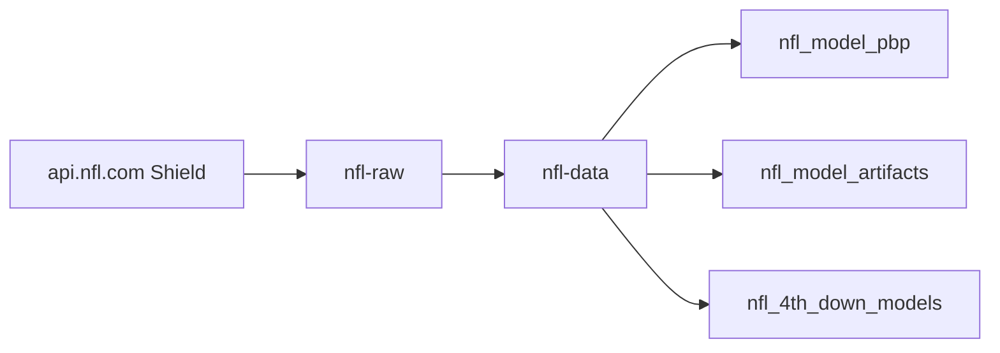
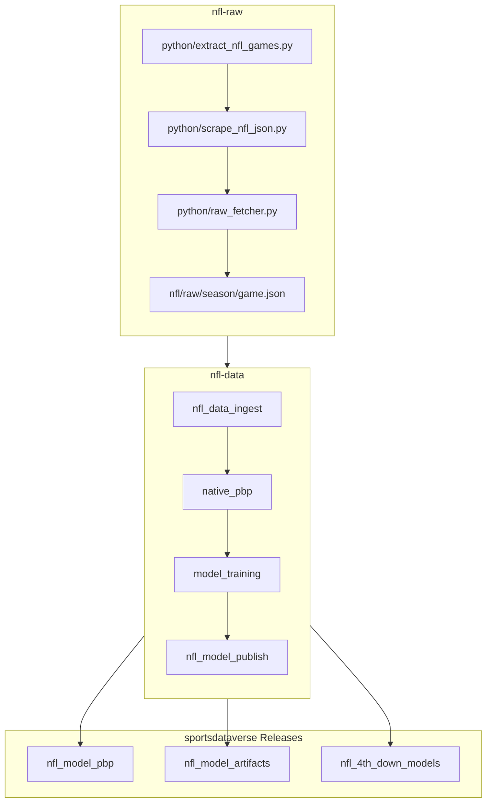

# nfl-raw

Committed per-game raw library of NFL Shield-API (`api.nfl.com`) game-detail
JSON, 1999–2026 (28 seasons, 7,277 games).

This repo is a **pure scraper**. Its sibling [`nfl-data`](https://github.com/sportsdataverse/nfl-data)
owns all reshaping, modeling and publishing — modeling was removed here in the
SP3 decommission.



## nflverse workflow diagram



## Layout

| path | contents |
|---|---|
| `nfl/raw/{season}/{season}_{week}_{away}_{home}.json` | one Shield game-detail payload per game |
| `python/extract_nfl_games.py` | resolve the game list for a season/week |
| `python/scrape_nfl_json.py` | the scrape driver |
| `python/raw_fetcher.py` | the fetch layer |

Filenames are `{season}_{week}_{away}_{home}` (e.g. `1999_01_ARI_PHI.json`), not
game ids — a consumer resolves them from the schedule rather than guessing.

## How consumers should read this repo

**Fetch individual game JSON over HTTP. Do not clone or check this repo out on
CI.** It is 229 MB today and grows every week; a runner that clones it is a
timeout waiting to happen.

```
https://raw.githubusercontent.com/sportsdataverse/nfl-raw/main/nfl/raw/{season}/{file}.json
```

Use a read-through cache keyed by filename so re-runs refetch nothing, validate
cached JSON before trusting it (a half-written entry from an interrupted run is
otherwise indistinguishable from a good one), and fail soft per game so one
missing file never aborts a season.
`cfbfastR-cfb-data`'s `cfb_data_ingest/fetch.py::fetch_final` is the reference
implementation of that shape.

## Setup

```sh
uv sync                # creates .venv, installs deps + dev group
uv run pytest          # tests/test_fetcher.py — monkeypatched, offline
```

Depends on [`sportsdataverse`](https://github.com/sportsdataverse/sportsdataverse-py)
(`sdv-py`, the `.nfl` submodule) for the authenticated Shield wrappers.

## Automation & status

| workflow | schedule | purpose |
|---|---|---|
| [`tests.yml`](.github/workflows/tests.yml) | on push / PR | offline unit tests |

Scrapes currently run **manually / locally**, not on a schedule in this repo —
there is no cron workflow here. `nfl-data` drives its own build cadence.

## Related repositories

- [nfl-data](https://github.com/sportsdataverse/nfl-data) — reshaping, modeling, publishing (source: this repo)
- [nflfastR](https://github.com/nflverse/nflfastR) — the R lineage this pipeline parallels
- [sportsdataverse-py](https://github.com/sportsdataverse/sportsdataverse-py) — the `nfl` submodule and Shield wrappers

Part of the [SportsDataverse](https://sportsdataverse.org/).
