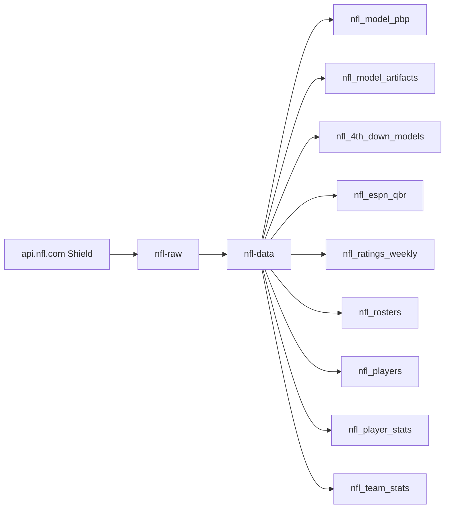
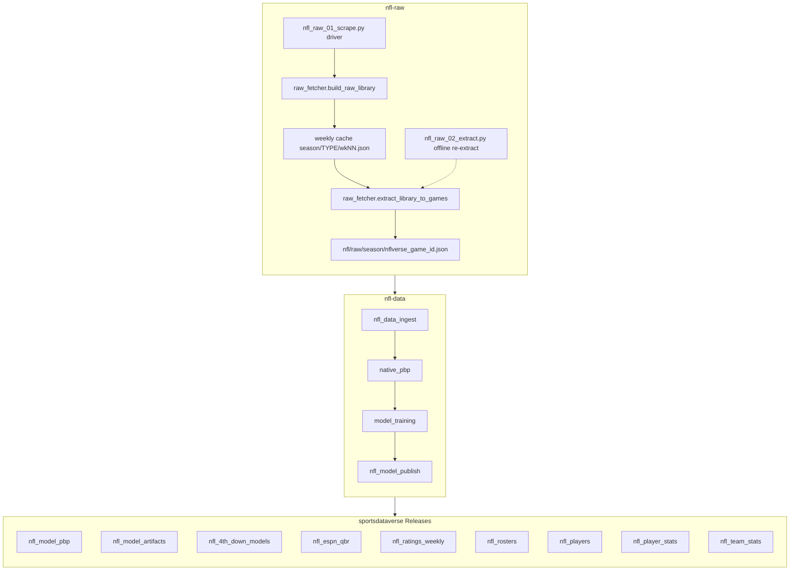

# nfl-raw

Committed per-game raw library of NFL Shield-API (`api.nfl.com`) game-detail
JSON, 1999–2026 (28 seasons, 7,598 games).

This repo is a **pure scraper**. Its sibling [`nfl-data`](https://github.com/sportsdataverse/nfl-data)
owns all reshaping, modeling and publishing — modeling was removed here in the
SP3 decommission.



## nflverse workflow diagram



## Layout

| path | contents |
|---|---|
| `nfl/raw/{season}/{nflverse_game_id}.json` | one Shield game-detail payload per game (the committed library) |
| `python/nfl_raw_01_scrape.py` | the scrape driver — fetches the weekly cache, then explodes it per game |
| `python/nfl_raw_scrape/raw_fetcher.py` | `build_raw_library` (weekly fetch) + `extract_library_to_games` (per-game write) + `nflverse_game_id` |
| `python/nfl_raw_02_extract.py` | **offline** re-extract: rebuilds the per-game library from an already-cached weekly library, no network |

**Two stages, not one.** `build_raw_library` writes a weekly cache at
`{season}/{REG,POST}/wk{NN}.json`; `extract_library_to_games` then explodes that
into the committed per-game files. `nfl_raw_02_extract.py` re-runs only the second
stage, which is what you want after changing game-id or relocation logic.

Filenames are **nflverse `game_id`s** — `{season}_{week:02d}_{away}_{home}`, e.g.
`1999_01_ARI_PHI.json` — produced by `raw_fetcher.nflverse_game_id()`. Two details
a consumer must not re-derive naively: postseason weeks continue past the regular
season (19-22 for 2021+, 18-21 for 1999-2020), and team abbreviations carry
season-aware relocation fixups (`LA` -> `STL` for the pre-2016 Rams). Resolve ids
from the schedule or that helper rather than formatting them by hand.

## How consumers should read this repo

**Fetch individual game JSON over HTTP. Do not clone or check this repo out on
CI.** The raw tree is ~3 GB of JSON today and grows every week; a runner that clones it is a
timeout waiting to happen.

```text
https://raw.githubusercontent.com/sportsdataverse/nfl-raw/main/nfl/raw/{season}/{nflverse_game_id}.json
```

Use a read-through cache keyed by filename so re-runs refetch nothing, validate
cached JSON before trusting it (a half-written entry from an interrupted run is
otherwise indistinguishable from a good one), and fail soft per game so one
missing file never aborts a season.
`cfbfastR-cfb-data`'s `cfb_data_ingest/fetch.py::fetch_final` is the reference
implementation of that shape.

## Setup

```sh
uv sync                # creates .venv, installs deps + dev group
uv run pytest          # tests/test_fetcher.py — monkeypatched, offline
```

Depends on [`sportsdataverse`](https://github.com/sportsdataverse/sportsdataverse-py)
(`sdv-py`, the `.nfl` submodule) for the authenticated Shield wrappers.

## Reports & explainers

<!-- BEGIN GENERATED: reports -->

| Report | What it is | Last updated |
|---|---|---|
| [NFL Track 6 — model reporting, figures & metrics](docs/model-reporting.md) | explainer | 2026-06-16 |
| [`-raw` → `-data` Migration Playbook (CFB reference → NFL target)](docs/raw-to-data-migration-playbook.md) | explainer | 2026-06-17 |

<!-- END GENERATED: reports -->

## Automation & status

The daily scrape runs on `scrape_nfl_raw.yml` (in-season cron); `nfl-data`
drives its own build cadence. This repo publishes **no releases of its own** (the raw library is the committed tree); the release tags below are
produced by `nfl-data` on `sportsdataverse-data`.

<!-- BEGIN GENERATED: status -->

| workflow | schedule | last run |
|---|---|---|
| [](https://github.com/sportsdataverse/nfl-raw/actions/workflows/scrape_nfl_raw.yml) | daily 11:45 UTC in Aug; daily 11:45 UTC in Sep-Dec; daily 11:45 UTC in Jan-Feb | 2026-08-31 |
| [](https://github.com/sportsdataverse/nfl-raw/actions/workflows/tests.yml) | on push / PR / dispatch | never run |

| release tag | assets | size | last publish |
|---|---:|---:|---|
| [`nfl_model_pbp`](https://github.com/sportsdataverse/sportsdataverse-data/releases/tag/nfl_model_pbp) | 27 | 168.7 MB | 2026-06-30 |
| [`nfl_model_artifacts`](https://github.com/sportsdataverse/sportsdataverse-data/releases/tag/nfl_model_artifacts) | 11 | 50.8 MB | 2026-06-24 |
| [`nfl_4th_down_models`](https://github.com/sportsdataverse/sportsdataverse-data/releases/tag/nfl_4th_down_models) | 2 | 66.9 MB | 2026-06-24 |
| [`nfl_espn_qbr`](https://github.com/sportsdataverse/sportsdataverse-data/releases/tag/nfl_espn_qbr) | 2 | 0.4 MB | 2026-06-23 |
| [`nfl_ratings_weekly`](https://github.com/sportsdataverse/sportsdataverse-data/releases/tag/nfl_ratings_weekly) | 27 | 0.8 MB | 2026-08-07 |
| [`nfl_rosters`](https://github.com/sportsdataverse/sportsdataverse-data/releases/tag/nfl_rosters) | 24 | 5.1 MB | 2026-07-12 |
| [`nfl_players`](https://github.com/sportsdataverse/sportsdataverse-data/releases/tag/nfl_players) | 1 | 0.4 MB | 2026-06-18 |
| [`nfl_player_stats`](https://github.com/sportsdataverse/sportsdataverse-data/releases/tag/nfl_player_stats) | 1 | 4.2 MB | 2026-06-23 |
| [`nfl_team_stats`](https://github.com/sportsdataverse/sportsdataverse-data/releases/tag/nfl_team_stats) | 1 | 0.9 MB | 2026-06-23 |

<!-- END GENERATED: status -->

## Related repositories

- [nfl-data](https://github.com/sportsdataverse/nfl-data) — reshaping, modeling, publishing (source: this repo)
- [nflfastR](https://github.com/nflverse/nflfastR) — the R lineage this pipeline parallels
- [sportsdataverse-py](https://github.com/sportsdataverse/sportsdataverse-py) — the `nfl` submodule and Shield wrappers

Part of the [SportsDataverse](https://sportsdataverse.org/).

## Consumers

The packages that read what this repo produces:

- **Python:** [`sportsdataverse.nfl (native pbp reconstruction)`](https://github.com/sportsdataverse/sportsdataverse-py) — docs at <https://py.sportsdataverse.org>
- consumed by [nfl-data](https://github.com/sportsdataverse/nfl-data) over HTTP

## Stage inventory

Every numbered pipeline stage in `python/` (auto-listed; run subsets with the `scripts/*.sh` drivers by number or name):

- `python/nfl_raw_01_scrape.py`
- `python/nfl_raw_02_extract.py`
